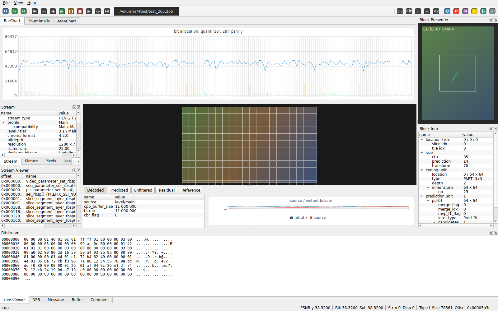

# VSA_GUI — Video Stream Analyzer GUI

A Qt 6 / C++20 desktop GUI that replicates the layout of **Elecard StreamEye**
(video bitstream analyzer) on macOS. This repository currently contains a
**GUI skeleton populated with mock data** — no real bitstream parser or
decoder is included yet.

 <!-- placeholder -->

## Features (skeleton)

- Main toolbar with placeholder actions (open / navigate / play / zoom / filters)
- Left dock: stream info tree (profile, resolution, frame rate, PSNR, ...)
- Center: tabbed chart area — **BarChart / Thumbnails / AreaChart**
- Center: decoded frame preview with CTU/PU grid overlay
- Center bottom: Decoded / Predicted / Unfiltered / Residual / Reference
  toggle + source/bitrate curve
- Right dock (top): motion-vector view
- Right dock (bottom): coding / prediction / transform unit tree
- Status bar: PSNR, block and display POC labels
- Arrow-key and click-driven frame navigation wired across every view

All data comes from `resources/sample/mock_stream.json`; the `MockDataProvider`
can be swapped out for a real bitstream parser later without touching the views.

## Requirements

- CMake ≥ 3.21
- A C++20 compiler (Apple Clang 14+, GCC 11+, MSVC 19.30+)
- Qt 6.5+ with the **Widgets** and **Charts** modules

### Installing Qt on macOS

```bash
brew install qt
```

### Installing Qt on Debian/Ubuntu

```bash
sudo apt install qt6-base-dev qt6-charts-dev cmake build-essential
```

## Build

```bash
cmake -S . -B build -DCMAKE_PREFIX_PATH="$(brew --prefix qt)"
cmake --build build -j
```

On Linux, drop the `-DCMAKE_PREFIX_PATH` flag.

## Run

```bash
# macOS
./build/vsa_gui.app/Contents/MacOS/vsa_gui

# Linux
./build/vsa_gui
```

## Project layout

```
src/
├── main.cpp
├── MainWindow.{h,cpp}           # Assembles the whole layout
├── model/                       # POD data model + MockDataProvider
├── views/                       # All QWidget / QChartView subclasses
└── widgets/                     # Toolbar factory + ViewModeSelector
resources/
├── resources.qrc
├── icons/                       # Placeholder toolbar icons
└── sample/
    ├── frame_000.png            # Dummy preview image
    └── mock_stream.json         # Mock stream / frame / CU / MV data
```

## Roadmap

- [ ] Real H.264 / HEVC / AV1 bitstream parsing
- [ ] FFmpeg / libavcodec integration for actual frame decoding
- [ ] Persist window state via `QSettings`
- [ ] i18n (English / Korean)

## License

TBD.
